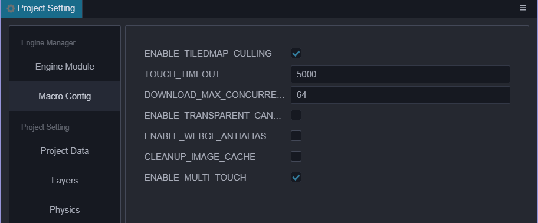
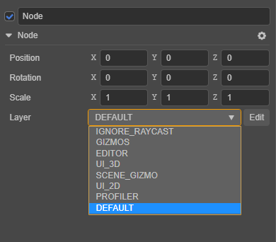
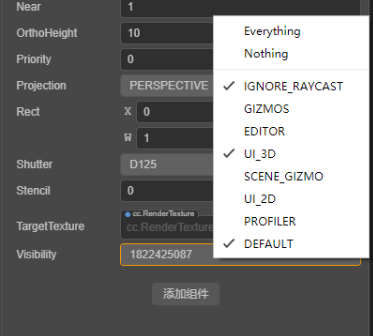

# Project Settings

The **Project Settings** windows are available from Cocos Creator 3D’s main menu (**Project > Project Settings**) which includes all the settings related to your project. These settings will be saved in the project's `settings / packages` folder. If you need to synchronize project settings between different developers, this folder should be added in your source control system.

## General


### Default Canvas settings

The default Canvas settings include design resolution and adapted screen width/height, which are used to specify the default design resolution value in Canvas when creating a new scene or Canvas component, as well as the `Fit Height, Fit Width` options.

For more information, please refer to the [Multi-resolution adaptation scheme](../ui-system/components/engine/multi-resolution.md) documentation.

## Engine Modules


The setting here is to crop the modules used in the engine to reduce the size of the released engine. Modules not selected in the panel will be cropped when they are packaged and previewed. It is recommended to perform a complete test after released to avoid using cropped modules in scenes and scripts.

## Macro Config

For more information and code of the engine macro module, please refer to the [Engine macro](https://github.com/cocos-creator/engine/blob/3d/cocos/core/platform/macro.ts#L824) documentation.

This panel here provide the convenience to modify the macro configuration. The **Macro Config** will take effect during preview and build. At the same time, the default value of the current macro configuration will be updated with the configuration of the custom engine.



## Texture Compress

> As of v1.2, the editor has modified the use of compressed texture configuration to configure presets in project settings and select presets for image asset's inspector. After the old version of the project is upgraded, the editor will automatically scan all the compressed texture configurations in the project and sort out as several presets.

Used to add compressed texture preset configuration, you can directly select the compressed texture preset to quickly add in the inspector of image asset. At the same time, after adding presets, you can also directly modify the presets to update batch texture compress configuration. Project settings allow users to add multiple compressed texture configurations, and each compressed texture configuration allows to add different format for different platform categories.

Platform is rough devised as following:

1. Web: refers to the two platforms Web-Mobile and Web-Desktop
2. Mac & Windows
3. iOS
4. Mini Game: Refers to the mini-games of various manufacturers' platforms, such as WeChat Mini Games and Huawei Quick Game Waiting;
5. Android

For the detail of the texture compression support of the platforms, please refer to the [Compressed Texture Chapter](../../asset/compress-texture.md) documentation.

### Add / remove texture compression presets

Enter the name of the compressed texture preset in the input box and press **Enter** or the plus button on the left to add it.


After adding the compressed texture preset, if you need to delete it, you can directly move the mouse to the preset name and click the delete button on the right.


### Add / remove texture compression format

Click the `Add Format` button, select the desired texture format, and configure the corresponding quality level. Currently, only one image format of the same type can be added at the same time.


To delete, move the mouse over the texture format and click the red delete button.

### Modify compressed texture preset name

The name of the compressed texture is only used for display. When adding a compressed texture preset, uuid will be randomly generated as the ID of the preset, so directly modifying the preset name will not affect the reference to the preset in the image asset.


If you want to replace all the preset options currently used for image asset, you can move the mouse to the preset name, click the button to copy the ID to and search and replace in the project by yourself.

### Export / import compressed texture presets

The compressed texture configuration page allows you to import and export compressed texture presets for better cross-project reuse configuration, or you can edit the compressed texture presets externally and import them into the editor.

In most cases, you can import and export directly. If you need to write this configuration yourself, you need to refer to the following interface definitions and examples:

```ts
type IConfigGroups = Record<ITextureCompressPlatform, IConfigGroupsInfo>;
type ITextureCompressPlatform = 'miniGame' | 'web' | 'ios' | 'android' | 'pc';
type ITextureCompressType =
    | 'jpg'
    | 'png'
    | 'webp'
    | 'pvrtc_4bits_rgb'
    | 'pvrtc_4bits_rgba'
    | 'pvrtc_4bits_rgb_a'
    | 'pvrtc_2bits_rgb'
    | 'pvrtc_2bits_rgba'
    | 'pvrtc_2bits_rgb_a'
    | 'etc1_rgb'
    | 'etc1_rgb_a'
    | 'etc2_rgb'
    | 'etc2_rgba'
    | 'astc_4x4'
    | 'astc_5x5'
    | 'astc_6x6'
    | 'astc_8x8'
    | 'astc_10x5'
    | 'astc_10x10'
    | 'astc_12x12';
type IConfigGroupsInfo = Record<ITextureCompressType, IQuality>
interface ICompressPresetItem {
    name: string;
    options: IConfigGroups;
}
```

Example:

```json
{
    "default": {
        "name": "default",
        "options": {
            "miniGame": {
                "etc1_rgb": "fast",
                "pvrtc_4bits_rgb": "fast"
            },
            "android": {
                "astc_8x8": "-medium",
                "etc1_rgb": "fast"
            },
            "ios": {
                "astc_8x8": "-medium",
                "pvrtc_4bits_rgb": "fast"
            },
            "web": {
                "astc_8x8": "-medium",
                "etc1_rgb": "fast",
                "pvrtc_4bits_rgb": "fast"
            },
        }
    },
    "transparent": {
        "name": "transparent",
        "options": {
            "miniGame": {
                "etc1_rgb_a": "fast",
                "pvrtc_4bits_rgb_a": "fast"
            },
            "android": {
                "astc_8x8": "-medium",
                "etc1_rgb_a": "fast"
            },
            "ios": {
                "astc_8x8": "-medium",
                "pvrtc_4bits_rgb_a": "fast"
            },
            "web": {
                "astc_8x8": "-medium",
                "etc1_rgb_a": "fast",
                "pvrtc_4bits_rgb_a": "fast"
            },
        }
    }
}
```

## Layers


- Layers allows the camera to render part of the scene and let the light illuminate part of the scene. It is also possible to deal with whether objects collide through Layers during ray inspection.
- You can customize 0 to 19 Layers, and the original settings will be deleted when you clear the input box.
- The last 12 Layers are built-in in the engine and cannot be modified.
- The positions currently used are: when editing the node node, the Layer property on the inspector panel; when editing the Camera node, the Visibility property.





## Physics


This config of physics will effect only when **Physics Module** is enabled in **Engine Module**.


The physical configuration will be used in the project preview and the code released by the project. The physical effects are reflected in the control of gravity, friction, kinetic energy transfer, and collision detection.

### Property description

- `gravity` Gravity vector, positive and negative values ​​reflect the directionality. **Default:** `{ x: 0, y: -10, z: 0 }`.
- `allowSleep` Whether to allow hibernation.**Default:** `true`.
- `sleepThreshold` The default speed threshold for entering sleep. **Default:** `0.1`，**Min:** `0`.
- `autoSimulation` Whether to enable automatic simulation.
- `fixedTimeStep` Fixed time spent in each simulation step.**Default:** `1/60`, **Min:** `0`.
- `maxSubSteps` Maximum number of substeps per simulation step. **Default:** `1`, **Min:** `0`.
- `friction` Coefficient of friction. **Default:** `0.5`.
- `rollingFriction` Rolling friction coefficient. **Default:** `0.1`.
- `spinningFriction` Spin friction coefficient. **Default:** `0.1`.
- `restitution` Coefficient of elasticity. **Default:** `0.1`.
- `useNodeChains` Whether to use a node chain to combine rigid bodies. **Default:** `true`.
- `useCollisionMatrix` Whether to use collision matrix. **Default:** `true`.
- `collisionMatrix` The setting result of the collision matrix. **Format:** `{ index: value }`, **Default:** `{ "0": 1 }`.

### Collision Matrix


The recognition of the collision matrix is ​​similar to the logic of Layers. Let’s call it **Groups**. Each Group is in the format of `{index: [index], name: [name] }`, `index` ranges from 0 to 31, and `name` is the name.

The `index` of **Groups**  is the horizontal axis x from large to small, and the vertical axis y from small to large. When the check box is checked, it means that the item on the x-axis and the item on the y-axis will have collision. collision
The recorded result takes the y-axis `index` value as the key name and `value` as the key value.

The engine defaults to a **Group** `{ index: 0, name:'DEFAULT' }` and it is checked by default, that is, the default `Collision Matrix` value of `DEFAULT` is 1.

You can add their own **Groups** to your project. Note that both `index` and `name` cannot be empty and cannot be repeated with existing items.


The operation rules are:

```
- Check value |= (1 << xIndex)
- Uncheck value &= ~(1 << xIndex)
```

注意一个勾选比如 `DEFAULT (y)` 勾选 `water (x)` 等同于赋值 `water (y)` 勾选 `DEFAULT (x)` ,第二个赋值在界面中没有体现，但依然会给与两次赋值，一次是设定 `DEFAULT (y)` ,一次是设定 `water (y)`。

Note that a check such as `DEFAULT (y)` checking `water (x)` is equivalent to assigning `water (y)` checking `DEFAULT (x)`, the second assignment is not reflected in the interface, but it will still Give two assignments, once to set `DEFAULT (y)` and once to set `water (y)`.


```js
    "collisionMatrix": {
      "0": 3,
      "1": 1
    }
```

## Bone map layout settings

Explicitly specify the bone texture layout to assist the instancing of the skinning models. For details, please refer to [here](joints-texture-layout.md).
