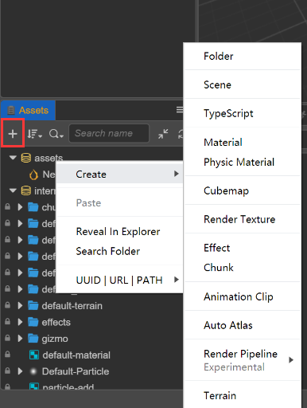
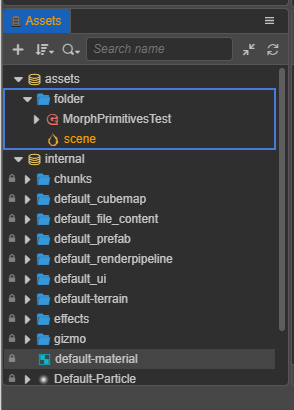
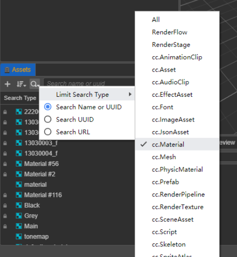
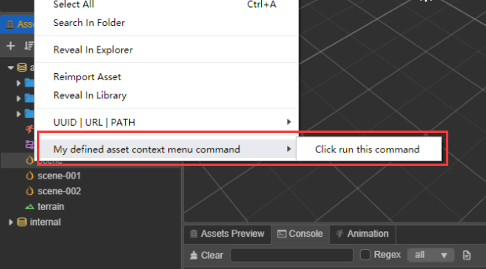
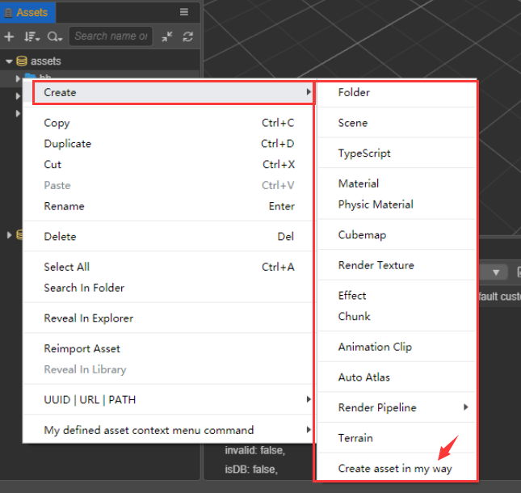

# 资源管理器

**资源管理器** 面板是我们用来访问和管理项目资源的重要工具。
在开始制作游戏时，**导入资源** 通常是必须的步骤。您可以在新建项目时使用模板项目，新建步骤完成后会自动打开项目，默认布局中包含了 **资源管理器** 面板，里面有两个资源库，简称 DB，`assets` 和 `internal`, `internal` 属于默认的内置资源，内置资源可以复制出来，但不能直接修改。

面板操作预览


## 面板介绍

**资源管理器** 面板上主要有 `头部菜单区 `， `树形列表区`：

- `头部菜单区` 的功能有：**新建资源按钮** ，**排序方式按钮** ，**搜索过滤** ，**搜索框**，**全部折叠或展开按钮** ，**刷新列表按钮**
- `树形列表区` 主要体现资源之间的关系，根节点如 `assets` 类似操作系统里的文件管理器，编辑器中称之为一个 DB
  - `assets` 是项目资源，新项目下默认为空；
  - `internal` 是内置资源，属于只读资源，不可进行增删改操作，但可以作为资源模板，复制到 Assets DB 上进行粘贴，即新建了一个项目资源。
  - 面板和节点都有右击菜单事件，是重要的操作功能，灰色为不可用菜单。
- 面板的快捷方式目前支持资源的操作：

  - 复制：Ctrl or Cmd + C
  - 粘贴：Ctrl or Cmd + V
  - 克隆：Ctrl or Cmd + D，Ctrl + 拖动资源
  - 删除：Delete
  - 上下选择：上下箭头
  - 文件夹的折叠：左箭头
  - 文件夹的展开：右箭头
  - 多选：Ctrl or Cmd + 点击
  - 全选：Ctrl or Cmd + A
  - 多选：Shift + 点击
  - 重命名： Enter/F2
  - 取消输入：Esc

## 新建资源

** + ** 号是 `assets` 新建资源按钮，或者文件夹的右击菜单，都可以进入创建资源。



文件夹内新增资源，会先出现一个 **输入框** 要求填入新资源的名称，名称不能为空。

## 打开资源

- 双击资源可打开该资源，比如 scene, script，image
- 双击文件夹的打开方式表现折叠或展开，切换子集资源的显示状态。

## 选中资源

在列表中可以使用以下操作选中资源：

- 单击可单选资源
- 键盘上下箭头可以上下切换选中资源
- 键盘左右箭头可以展开或折叠父级类型的资源，如文件夹
- 按住 Ctrl or Cmd + 点击，可以多选资源
- 按住 Shift + 点击，可以多选资源

右击菜单中的 **在文件夹内全选** 或快捷键 **Ctrl+A** 可实现在文件夹内全部子资源的选中，多次全选操作会逐层往上全选。

## 移动资源

通过拖动来实现资源的移动：

- 移动资源，资源从树形列表中的一个文件夹里拖出到另一个文件夹，此时会出现一个目标文件夹范围的框，表示放置的位置。
- 拖出资源到 **场景面板** 或 **层级面板** 去生成节点，目前支持 `cc.Prefab`, `cc.Mesh`, `cc.SpriteFrame` 资源。
- 从 **系统的文件管理器** 拖动文件到列表中，实现导入资源。
- 拖入节点，从 **层级面板** 拖动节点到 **资源面板** 里某个文件夹，可实现保存该节点为一个 `cc.Prefab` 资源, 详见 [预制资源（Prefab）](../../asset/prefab.md)；



## 删除资源

可操作右击菜单中的 **删除** 按钮，或快捷键 **Delete**，支持多选后批量删除，资源删除后保留在 **系统的回收站** 里，必要时可将其还原。

## 折叠资源

折叠分为单一折叠或含子集的全部折叠；

- `头部菜单区` **全部折叠或展开按钮** 作用于全局；
- 单击一个父级资源如文件夹的三角图标，可以展开或折叠它的子集；
- 快捷键 **Alt+点击三角图标** 实现子资源全部展开或折叠
- 折叠状态有记录，下次打开编辑器会保持当前的折叠状态。

## 排序资源

- 头部菜单中的 **排序方式按钮** 有 2 种排序方式：**按名称排序**，**按类型排序**，
- 排序方式有记录，下次打开编辑器会保持当前的排序方式。

## 搜索资源

搜索功能是一种组合的功能，可限定搜索类型，且指定搜索字段。

- **限定搜索类型** ，可多选。类型为资源类型 assetType，不是后缀名称或 importer 名称。
- 指定搜索字段有 3 种方式：**搜索名称 或 UUID**，**搜索 UUID**，**搜索 URL**。名称不区分大小写。
- 其中 **UUID** 和 **URL** 可从右击菜单最后一项中输出数据。
- 在搜索结果列表中选中资源，双击资源等同于在正常模式下的操作。清空搜索，视窗会重新定位到选中的资源。
- 右击菜单中的 **文件夹内搜索** 可缩小搜索范围。




## 重命名资源

- 选中某个资源
- 快捷键 `F2`，快捷键 `Enter`，进入名称修改
- 快捷键 `Esc` 取消重命名
- 此外 ts 脚本资源的初始名称会处理为它的 `className`, 而 `className` 是不能重复的。

## 在文件管理器中显示

右击菜单中的 **在文件管理器中显示** 可定位资源所在的系统目录。

## 重新导入资源

右击菜单中的 **重新导入资源** 可以更新资源到项目的 `./library` 文件夹，支持多选批量导入。

## 大图预览

此外可与 Assets Preview 面板配合， 点击一个文件夹，可按类型排列显示大图子资源，对于图片资源会较为直观。


## 扩展 Assets 面板

插件间的扩展，走常规的 \*\* \*\* 流程，Assets 面板支持扩展的位置和功能有限，这是逐步开放的过程，有新的需求可在论坛中反馈，目前支持的扩展有：

1.  拖入识别
2.  右击菜单

注入扩展的主要流程为：

- 新建一个插件
- 插件 package.json `contributions` 指定 `"assets": "./contributions-assets.js"`
- `contributions-assets.js` 输出 module.exports
- module.exports 内容格式为 { Drop, Menu }

```typescript
// onDrop 动作会触发 Message.send('extensionName', 'messageName', asset:IAssetInfo)
interface DropItem {
  type: string;
  message: 'messageName';
}
export const Drop: DropItem[] = [];

/**
 * 扩展右击菜单
 * Eelectron MenuItem https://www.electronjs.org/docs/api/menu-item
 * 
 * path 扩展的区域可选值：
    "create" 位置：创建资源
    "asset" 位置：普通资源的右击菜单
    以下尚不支持
    "db" 位置：DB 根节点的右击菜单
    "panel" 位置：面板空白区域的右击菜单
    "sort" 位置：面板头部排序按钮的菜单
    "search" 位置：面板头部搜索按钮的菜单
 */
interface Menu extends MenuItem {
  path: string; // 扩展的区域
}
export const Menu: Menu;


// 其他数据格式说明

interface IAssetInfo extends AssetInfo {
  additional: IDragAdditional[]; // 追加拖拽可识别的类型
  fileName: string; // 文件名，不包含后缀
  fileExt: string; // 后缀，不包含点好
  isParent: boolean; // 是否是父节点
  isDB: boolean; // 是否是 DB 根节点
  isSubAsset: boolean; // 是否是 subAsset, 
  depth: number; // 树形层级
  left: number; // 缩进的大小
  refreshTime: number; // 每次刷新的当前时间戳，目前用于缩略图的刷新
}

interface IDragAdditional {
  type: string;
  value: string;
  name?: string; // 节点或资源名称
}

interface AssetInfo {
  // 资源名字
  name: string;
  // 资源用于显示的名字
  displayName: string;
  source: string;
  // loader 加载的层级地址
  path: string;
  // loader 加载地址会去掉扩展名，这个参数不去掉
  url: string;
  // 绝对路径
  file: string;
  uuid: string;
  // 使用的导入器名字
  importer: string;
  // 类型
  type: string;
  // 是否是文件夹
  isDirectory: boolean;
  // 导入资源的 map
  library: { [key: string]: string };
  // 子资源 map
  subAssets: { [key: string]: AssetInfo };
  // 是否显示
  visible: boolean;
  // 是否只读
  readonly: boolean;

  // 虚拟资源可以实例化成实体的话，会带上这个扩展名
  instantiation?: string;
  // 跳转指向资源
  redirect?: IRedirectInfo;
  // 继承类型
  extends?: string[];
}

interface IRedirectInfo {
  // 跳转资源的类型
  type: string;
  // 跳转资源的 uuid
  uuid: string;
}
```

细节太多，附上一个 demo 源码，点击下载：
<a href="img/extend-assets-menu.zip" target="_blank">extend-assets-menu.zip</a>




